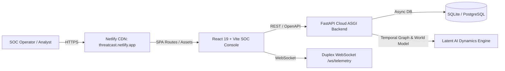

# ThreatCast Platform — End-to-End Production Cloud Deployment Guide

This guide details the complete, zero-friction deployment of both the **React 19 Frontend (Netlify)** and the **FastAPI Asynchronous Backend (Render / Railway / Cloud VPS)**.

---

## Architecture Overview



---

## Part 1: Backend Deployment on Render (Recommended - Free Tier)

Render natively supports Python web services with automated GitHub continuous deployment and free SSL.

### Step 1: Deploy Web Service on Render
1. Navigate to **[dashboard.render.com](https://dashboard.render.com)** and sign in with GitHub.
2. Click **"New +"** in the top right $\to$ **"Web Service"** (or **"Blueprint"**).
3. Connect your repository: `utkarshkhampar/ThreatCast-AI-Network-Attack-Forecasting`.
4. Configure the service settings (or let `render.yaml` auto-configure):
   - **Name**: `threatcast-backend`
   - **Region**: Oregon (US West) or Frankfurt (EU)
   - **Branch**: `main`
   - **Runtime**: `Python 3`
   - **Build Command**: `pip install --upgrade pip && pip install -r requirements.txt && pip install greenlet`
   - **Start Command**: `uvicorn backend.app.main:app --host 0.0.0.0 --port $PORT`
   - **Instance Type**: `Free`
5. Click **"Create Web Service"**.

### Step 2: Obtain Your Public Backend URL
Once Render completes building (approx. 1–2 minutes), it provides a permanent public HTTPS URL, for example:
```
https://threatcast-backend.onrender.com
```
Verify the backend is live by opening:
```
https://threatcast-backend.onrender.com/health
https://threatcast-backend.onrender.com/docs
```

---

## Part 2: Backend Deployment on Railway (Alternative)

1. Go to **[railway.app](https://railway.app)** and log in with GitHub.
2. Click **"New Project"** $\to$ **"Deploy from GitHub repo"**.
3. Select `ThreatCast-AI-Network-Attack-Forecasting`.
4. Railway will automatically detect `railway.json` and build the service.
5. In **Settings** $\to$ **Networking**, click **"Generate Domain"** to get a public URL (e.g., `https://threatcast-production.up.railway.app`).

---

## Part 3: Connect Frontend (Netlify) to Live Backend

Now link your Netlify frontend (`threatcast.netlify.app`) to your live cloud backend:

1. Open your site on **[app.netlify.com](https://app.netlify.com)** $\to$ select `threatcast`.
2. Go to **Site configuration** $\to$ **Environment variables**.
3. Click **"Add a variable"**:
   - **Key**: `VITE_API_BASE_URL`
   - **Value**: `https://threatcast-backend.onrender.com/api/v1` *(replace with your actual backend URL)*
4. Go to **Deploys** $\to$ **Trigger deploy** $\to$ **Clear cache and deploy site**.
5. Once the deploy completes (~30 seconds), your frontend at `threatcast.netlify.app` will be connected live to your cloud backend!

---

## Part 4: Verification Checklist

Once both services are deployed:
- [ ] Visit `https://threatcast.netlify.app/register` and register an operator. Real backend records and verification codes are processed.
- [ ] Visit `https://threatcast.netlify.app/dashboard` and confirm live telemetry and forecasts stream from the API.
- [ ] Open browser DevTools (`F12` $\to$ **Network**) and verify API requests route to your live backend endpoint.
